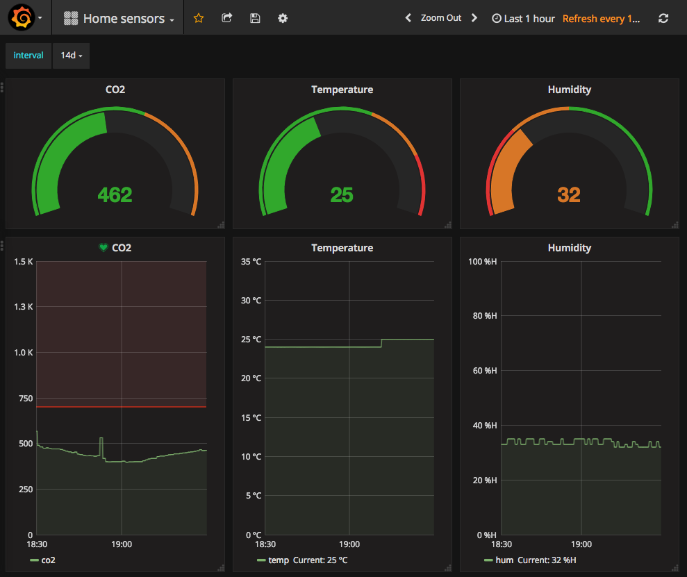

# nodemcu-co2-temp-hum-grafana

Sensor that outputs:

- co2 from MH-Z19 sensor
- temperature and humidity from DHT11 sensor

Sensor broadcasts at UDP 6650.

This is modification of project [http://www.crystalairfresh.ucoz.net](http://www.crystalairfresh.ucoz.net/publ/dlja_samostojatelnoj_sborki/opisanie_pribora/prostoj_pribor_izmerenija_so2_temperatury_i_vlazhnosti/6-1-0-12)



# Wiring
- Connect MH-Z19 to pin 1 and 5v
- Connect DHT11 to pin 2 and 5v

# Setup nodemcu

## Flash firmware
Get firmware from https://nodemcu-build.com/ with modules:

- dht
- file
- gpio
- net
- node
- pwm
- tmr
- uart
- wifi

```
esptool.py --port COM3 write_flash 0x00000 /path/to/nodemcu_float.bin
```

## Set Wifi credentials
Open `start.lua` and change wifi ssid and password.

## Upload 
I am just open all lua files in ESPlorer and upload it, `init.lua` should be uploaded last.

# Setup other
I am using it with Grafana, Telegraf and InfluxDB.

## Generate json
Put file in cron:

```
#!/bin/bash

output_path="/path/to/co2-temp-hum-sensor.json"
location="room"

get_s() {
	echo "$1" | grep -oE "S$2=[0-9]+" | cut -d'=' -f2
}

line="$(nc -u -l 6650 -w 5 | grep -oE "S1=.+")"
echo '{"temp":'$(get_s "$line" 1)',"hum":'$(get_s "$line" 2)',"co2":'$(get_s "$line" 3)',"location":"$location"}' > "$output_path"
```

It should generate file such:
``` json
{"temp":25,"hum":32,"co2":452,"location":"room"}
```

## Setup nginx
```
server {
   listen 80;
   server_name sensors.myhome;
   root /path/to/sensors/output_dir;
}
```

## Setup Telegraf
Add to `/etc/telegraf/telegraf.conf`:
```
[[inputs.httpjson]]
    servers = [ "http://sensors.myhome/co2-temp-hum-sensor.json" ]
    name = "home"
    tag_keys = [ "location" ]
```

## Setup Grafana
Import [grafana-sensors-dashboard.json](grafana-sensors-dashboard.json) to Grafana.
